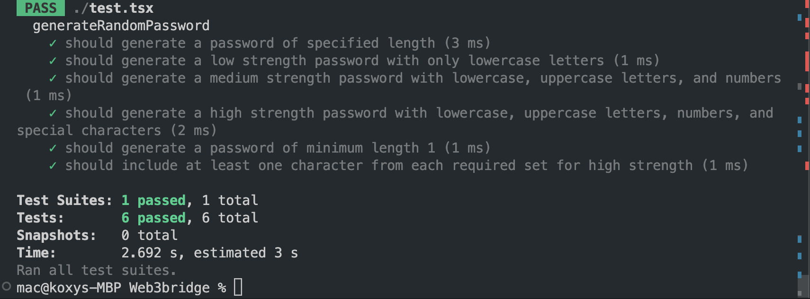

# Random Password Generator

## Description

- This repository contains a TypeScript implementation of a random password generator, along with a comprehensive test suite to ensure its functionality. The password generator can produce passwords of varying strengths: low, medium, and high.

### Features

- Low Strength: Generates passwords containing only lowercase letters.
- Medium Strength: Generates passwords containing lowercase letters, uppercase letters, and numbers.
- High Strength: Generates passwords containing lowercase letters, uppercase letters, numbers, and special characters.

## Installation

- Clone the repository
- Install dependencies: `npm install
`

## Running the Tests

- To run the test suite, use the following command:
- `npm test`

### Script interaction

